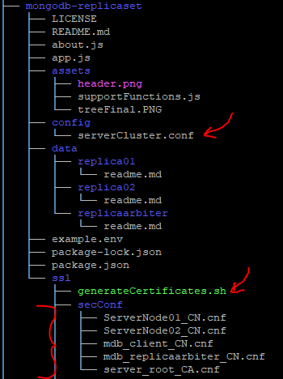
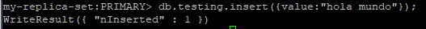

<link rel="stylesheet" href="https://use.fontawesome.com/releases/v5.15.2/css/all.css" integrity="sha384-vSIIfh2YWi9wW0r9iZe7RJPrKwp6bG+s9QZMoITbCckVJqGCCRhc+ccxNcdpHuYu" crossorigin="anonymous">

[](https://www.linkedin.com/in/kathesama)

<br>
[](https://github.com/kathemica/mongodb-replicaset/issues)
[](https://github.com/kathemica/mongodb-replicaset/network)
[](https://github.com/kathemica/mongodb-replicaset/stargazers)


<br>
[](https://github.com/kathemica/mongodb-replicaset/blob/main/LICENSE)

<br>


---
# FIUBA - MongoDB replicaset con tres (03) nodos y TLS
Autor
* Ing. Katherine E. Aguirre
<br>
<br>
<p><i class="fas fa-exclamation-triangle" style="color:#ff9900"></i>&nbsp;&nbsp;Advertencia:</p>

Se hacen las siguientes presunciones:

* <i class="fab fa-docker" style="color:blue"></i> El cliente donde se va a configurar el *replicaset* ya posee instalado y configurado *Docker* como contenedor de imágenes.
* <i class="far fa-hand-paper" style="color:red"></i> NO SE UTILIZA **docker-compose** EN ESTE PROYECTO

---

## Implementar en MongoDB un ReplicaSet con 3 servidores que contengan la información de la BD Finanzas. Un nodo Primary, un secondary y un arbiter.<br>
---

Esta implementación se realizará con Docker Run, de esta manera quedarán los volúmenes corriendo de una vez, ahora procederemos:

1. Ir a la carpeta donde se van a guardar los datos y clonar el respositorio:

> git clone https://github.com/kathemica/mongodb-replicaset.git

2. Ahora vamos a mover los archivos necesarios para correr el script, desde la misma carpeta ejecutamos: 
```
$ sudo mv -v mongodb-replicaset/ssl/scripts/prod_env/* mongodb-replicaset/ssl/
```
**NOTA: dependiendo del ambiente selecciona: *prod_env* ó *dev_env***

Luego para dejar más limpia la estructura removemos la carpeta que no nos hace falta:
```
$ sudo rm -r mongodb-replicaset/ssl/scripts
```

3. Ahora procederemos a cambiar los permisos del script:
```
$ sudo chmod 755 mongodb-replicaset/ssl/generateCertificates.sh
```

4. Una vez hecho esto debemos seleccionar el archivo de configuración, para esto ejecutaremos:
```
$ sudo mv mongodb-replicaset/config/serverCluster.prod.conf mongodb-replicaset/config/serverCluster.conf
```
**NOTA: dependiendo del ambiente renombra a sólo *.conf* bien sea *.dev.conf* ó *prod.conf*** 


Igualmente procedemos a borrar lo que nos sobra:

```
$ sudo rm -r mongodb-replicaset/config/serverCluster.dev.conf
```

Al final de todas estas operaciones nos debería quedar la siguiente estructura:



5. Luego ejecutamos el script para generar los certificados, navegamos hasta la carpeta ssl y ejecutamos el script:
> cd mongodb-replicaset/ssl/

> ./generateCertificates.sh

Luego de ejecutar el script nos queda la siguiente estructura:


6. Una vez que se haya ejecutado el archivo y configurado todo el sistema de certificados procedemos a levantar las instancias:

---

**Primera instancia**:<br> 
```
 sudo docker run --name MGDB_replica01 \
-p 27017:27017 \
--restart always \
-e "TZ=America/Argentina/Buenos_Aires" \
-e MONGODB_EXTRA_FLAGS='--wiredTigerCacheSizeGB=1' \
-v $(pwd)/data/replica01:/data/db \
-v $(pwd)/ssl/nodo01:/data/ssl \
-v $(pwd)/config:/data/config \
-e MONGO_INITDB_ROOT_USERNAME=mdb_admin \
-e MONGO_INITDB_ROOT_PASSWORD=mdb_pass \
mongo:4.4.4-bionic \
mongod --config /data/config/serverCluster.conf
```
---

**Segunda instancia**:<br>
```
sudo docker run --name MGDB_replica02 \
-p 27018:27017 \
--restart always \
-e "TZ=America/Argentina/Buenos_Aires" \
-e MONGODB_EXTRA_FLAGS='--wiredTigerCacheSizeGB=1' \
-v $(pwd)/data/replica02:/data/db \
-v $(pwd)/ssl/nodo02:/data/ssl \
-v $(pwd)/config:/data/config \
-e MONGO_INITDB_ROOT_USERNAME=mdb_admin \
-e MONGO_INITDB_ROOT_PASSWORD=mdb_pass \
mongo:4.4.4-bionic \
mongod --config /data/config/serverCluster.conf
```
---

**Tercera instancia**:<br>
```
sudo docker run --name MGDB_replicaArbiter \
-p 27019:27017 \
--restart always \
-e "TZ=America/Argentina/Buenos_Aires" \
-e MONGODB_EXTRA_FLAGS='--wiredTigerCacheSizeGB=1' \
-v $(pwd)/data/replica:/data/db \
-v $(pwd)/ssl/nodo_arbiter:/data/ssl \
-v $(pwd)/config:/data/config \
-e MONGO_INITDB_ROOT_USERNAME=mdb_admin \
-e MONGO_INITDB_ROOT_PASSWORD=mdb_pass \
mongo:4.4.4-bionic \
mongod --config /data/config/serverCluster.conf
```
---
**NOTA: HASTA ACÁ TODOS LOS PASOS PREVIOS SE PUEDEN AHORRAR EJECUTANDO:**

>sh config.sh `<dev>|<prod>` <CERT_PASS>

Dependiendo del ambiente selecciona *dev* ó *prod*, seguido de la password del certificado CA

I.e:
> source ./config.sh dev b2RlIjoiUEdPIiwiZmFsbGJhY2tEYXRlIjoiMjAyMS

*Este script ejecuta todos los pasos previos y deja el ambiente listo para configurar con los pasos que siguen.*

---

7. Esperamos a que termine de ejecutar el ultimo comando y entramos a la consola de mongo del primer nodo:

> docker exec -it MGDB_replica01 /bin/bash

Este comando permite loguearse como root en mongo dentro de Docker, es necesario loguearse como root porque necesitamos configurar el replicaset y crear los usuarios.

**NOTA: Ten en cuenta que estamos dentro del contenedor y se estan replicando en los volumenes mapeados.**

**OTRA NOTA: Recuerda que la contraseña está seteada en el script y en el archivo serverCluster, es la misma que estaremos usando acá para desencriptar el certificado self-signed.**

```
mongo --tls --tlsCertificateKeyFile /data/ssl/mdb_nodes_keycert.pem --tlsCAFile /data/ssl/server_root_CA.crt --tlsCertificateKeyFilePassword b2RlIjoiUEdPIiwiZmFsbGJhY2tEYXRlIjoiMjAyMS --tlsAllowInvalidHostnames
```

Ahora creamos el archivo de configuracion del cluster
```
rs.initiate({
  "_id": "my-replica-set", 
  "version": 1, 
  "writeConcernMajorityJournalDefault": true, 
  "members": [
    { 
      "_id": 0, 
      "host": "10.0.0.12:27017", 
    }, 
    { 
      "_id": 1, 
      "host": "10.0.0.12:27018", 
    }, 
    { 
      "_id": 2, 
      "host": "10.0.0.12:27019", 
      arbiterOnly: true 
    }
  ]
});
```

Luego tecleamos lo siguiente:

> use admin;

Después esto otro:

```
db.createUser({
  user: "mdb_admin",
  pwd: "mdb_pass",
  roles: [
    {role: "root", db: "admin"},
    { role: "userAdminAnyDatabase", db: "admin" }, 
    { role: "dbAdminAnyDatabase", db: "admin" }, 
    { role: "readWriteAnyDatabase", db:"admin" }, 
    { role: "clusterAdmin",  db: "admin" }
  ]
});
```

*Et voilá* deberiamos estar listos para poder acceder al replicaset empleando TLS. Ahora salimos de la consola del nodo para entrar nuevamente en el siguiente paso.
>$ exit


**NOTA:
Si al ejecutar el comando de crear el usuario obtienes este mensaje:**
>uncaught exception: Error: couldn't add user: command createUser requires authentication :
_getErrorWithCode@src/mongo/shell/utils.js:25:13
DB.prototype.createUser@src/mongo/shell/db.js:1386:11

Tienes que ir a *serverCluster.conf* y modificar:
```
security:
  authorization: enabled
```
por:

```
security:
  authorization: disabled
```

Una vez creado el usuario vuelves a modificar el archivo y reinicias el cluster.

---
## Conectarse al Nodo PRIMARY
---

Para poder hacer operaciones con el cluster podemos acceder desde la consola:

> docker exec -it MGDB_replica01 /bin/bash

luego emplear el siguiente connection string:

```
mongo --tls --tlsCertificateKeyFile /data/ssl/mdb_nodes_keycert.pem --tlsCAFile /data/ssl/server_root_CA.crt --tlsCertificateKeyFilePassword b2RlIjoiUEdPIiwiZmFsbGJhY2tEYXRlIjoiMjAyMS -u $MONGO_INITDB_ROOT_USERNAME -p $MONGO_INITDB_ROOT_PASSWORD --tlsAllowInvalidHostnames
```
---
##  Poblar la base de datos.
---

Una vez conectados creamos la DB *iot*, para ello:

> use iot;

Así de simple, en mongodb no hay un comando para crear bases de datos como tal, no crearemos la *collection* aun porque de ello se encargará la app de node. Ahora vamos a crear algunos índices para mejorar la performance de la base de datos, seleccionamos todo el texto y lo pegamos en la consola, al final presionas enter:

```
// Indices para data no agrupada
db.devices.createIndex({"date.year" : 1,"date.month" : 1,"date.day" : 1,"date.hour" : 1});
db.devices.createIndex({"deviceId" : 1,"telemetry.temperature" : 1});
db.devices.createIndex({"telemetry.temperature" : 1,"telemetry.humidity" : 1});
db.devices.createIndex({"deviceId" : 1,"sensor" : 1,"telemetry.humidity" : 1});

// Indices para data agrupada (Independiente del dia y la hora)
db.devices.createIndex({"deviceId" : 1,"telemetry.full" : 1});
db.devices.createIndex({"telemetry.temperature" : 1,"telemetry.humidity" : 1});

// Indices para datos específicos agrupados por fecha/hora
db.devices.createIndex({"deviceId" : 1,"sensor" : 1,"date.year" : 1,"date.month" : 1,"date.day" : 1,"date.hour" : 1});
db.devices.createIndex({"date.year" : 1,"date.month" : 1,"date.day" : 1,"date.hour" : 1});

// Indices relacionados con el día
db.devices.createIndex({"deviceId" : 1,"sensor" : 1,"date.year" : 1,"date.month" : 1,"date.day" : 1});
db.devices.createIndex({"date.year" : 1,"date.month" : 1,"date.day" : 1});
```

Salimos de la consola de mongo y volvemos al prompt para seguir haciendo algunas operaciones más.

>$ exit <-- dos (02) veces

Como punto adicional podemos usar la herramienta Portainer o Yatch para visualizar el estado de nuestros contenedores y sus logs.

*Contenedores*


*Logs*


Ahora, vamos a usar la aplicación de node para popular la base de datos con data mockeada de sensores, pero antes tenemos que terminar de configurar el entorno, para ello:

1. Vamos a la raíz de nuestro proyecto y renombramos el archivo *env*:

> sudo mv example.env .env

2. Lo editamos:

>sudo nano .env

Seteamos nuestra configuración para las variables de entorno, en este caso deberia contener lo siguiente:

* CA_CERT='path/al/archivo/CA' *<-- debería ser './ssl/client/server_root_CA.crt'*
* KEY_CERT= 'path/al/archivo/key' *<-- sería './ssl/client/client.key'*
* PEM_CERT= 'path to your pem cert file' *<-- cambia a './ssl/client/client.pem'*
* CA_TOKEN= 'put your ca token here' *<-- acá ponemos el token del archivo CA, recuerda que es el que se encuentra en serverCluster.conf*
* REPLICASET= 'put your replica set name here' *<-- el nombre que le pusimos al replica set, recuerda que es **my-replica-set** para este ejemplo*
* SERVERNAME= 'put your server ip here' *acá ponemos la direccion IP o el nombre del servidor*
* SERVICE_PORT= mongoServicePortHere *El puerto que le hubieres puesto al set, acá estamos usando el 27017*

3. Ahora procedemos a instalar los paquetes de node, para ello:
>npm i

---
## Creando volúmen de datos  
---
Ejecutamos 4 veces la app veces para crear volumen de datos.

> node app

---
##  Buscar los datos insertados, en el nodo PRIMARY.
---

Vamos a verificar los datos usando mongo compass. Para ello debemos tener acceso a los certificados del cliente, una vez que los consigamos procedemos a configurar la herramienta:

**NOTA: es posible que te aparezca un error cuando estés copiando el certificado client.key, lo resolvemos ejecuntando:**

>  sudo chmod 775 client.key

a. La herramienta se llama [MongoDB Compass](https://www.mongodb.com/try/download/compass "The database for
modern applications"), seguimos el link, descargamos e instalamos.

b. Hacemos click en lo subrayado


c. Tecleamos la IP o nombre del servidor, el puerto y seleccionamos X.509 en la autenticación, luego hacemos click en la solapa **More Options**.


d. Tecleamos el nombre del replica set, el tipo de nodo al que nos conectaremos de preferenciam, seleccionamos el tipo de validacion SSL que tendremos, luego cargamos los tres (03) certificados y la clave de desencriptado del certificado, finalmente clickeamos en **Connect**.


e. Una vez conectados podremos ver como está estructurado nuestro Replica set, cuantos nodos lo componen, nombres, bases de datos, tamaños, entre otros.


f. Hacemos click en IOT para ver los detalles, sus colecciones y los detalles.


g. Finalmente podemos ver el detalle de la coleccion con los datos insertados en ella.


---
##  Buscar los datos insertados, en el nodo SECONDARY.
---

Nos conectamos en la consola al contenedor en docker
>$ docker exec -it MGDB_replica02 /bin/bash

>$ mongo --tls --tlsCertificateKeyFile /data/ssl/mdb_nodes_keycert.pem --tlsCAFile /data/ssl/server_root_CA.crt --tlsCertificateKeyFilePassword b2RlIjoiUEdPIiwiZmFsbGJhY2tEYXRlIjoiMjAyMS -u $MONGO_INITDB_ROOT_USERNAME -p $MONGO_INITDB_ROOT_PASSWORD --tlsAllowInvalidHostnames

>$ rs.secondaryOk();

>$ use iot; 

>$ db.devices.count();

Verificamos que el número sea igual al número de dispositivos creados en la app de node, en este caso serían 1000


---
##  Realizar un ejemplo de Fault Tolerance simulando una caída del Servidor PRIMARY.
---
Empleando el comando *rs.status()* verificamos el estado de los servidores antes de apagar uno.


Usando Portainer vamos a detener el nodo primario para provocar una falla.

Antes


Después


---
##  Explicar que sucedió.
---

Al momento en que se apaga uno de los nodos se ejecuta la votación y se selecciona otro nodo como primario, en este caso el que estaba como secundario pasa a ser primario porque el otro nodo está definido como  arbiter por lo que no puede registrar datos y está sólo como votante para definir desempates en casos de haberlos.

---
##  Verificar el estado de cada servidor.
---

Para saber el estado de los servidores usamos el comando

> rs.status() 

Paso previo hay que entrar a la consola del nodo que esta levantado y loguearse usando las credenciales:

Observamos el resultado:


Podemos ver el nodo que está caído, el que estaba secundario pasa a ser primario y está ejecutándose.


---
##  Insertar un nuevo documento.
---

Para insertar un nuevo documento, debemos:

- seleccionar la base de datos:

> uset iot;

- insertamos un documento de prueba en una nueva colección.

> db.testing.insert({value:"hola mundo"});



Igualmente hacemos la comprobación en compass y verificamos que esté:


---
##  Levantar el servidor caído.
---

Hacemos el procedimiento opuesto y levantamos la instancia en portainer


en el log podemos ver el proceso de replicación de datos.


---
##  Validar la información en cada servidor.
---

Abrimos otra consola y nos logueamos con el nodo que acabamos de levantar, luego ejecutamos 

>$ rs.secondaryOk();

>$ use iot;

>$  show collections

Deberiamos poder ver las dos colecciones que se crearon en el otro nodo.


---
##  Agregar un nuevo nodo con slaveDelay de 120 segundos.
---

Por cada nuevo nodo que se agregue se deben crear sus respectivas credenciales TLS y levantar la instancia en mongo, para ello:

- vamos a la carpeta ssl/node_cnf y ejecutamos lo siguiente recordando cambiar XX por el número de nodo a agregar:

> cp nodo01_CN.cnf nodoXX_CN.cpp


---
##  Ejecutar nuevamente el script facts.js, asegurarse antes de ejecutarlo que el nodo con slaveDelay esté actualizado igual que el PRIMARY.
---

---
##  Luego de ejecutado chequear el SECONDARY.
---

---
##  Consultar el nuevo nodo y ver cuando se actualizan los datos.
---